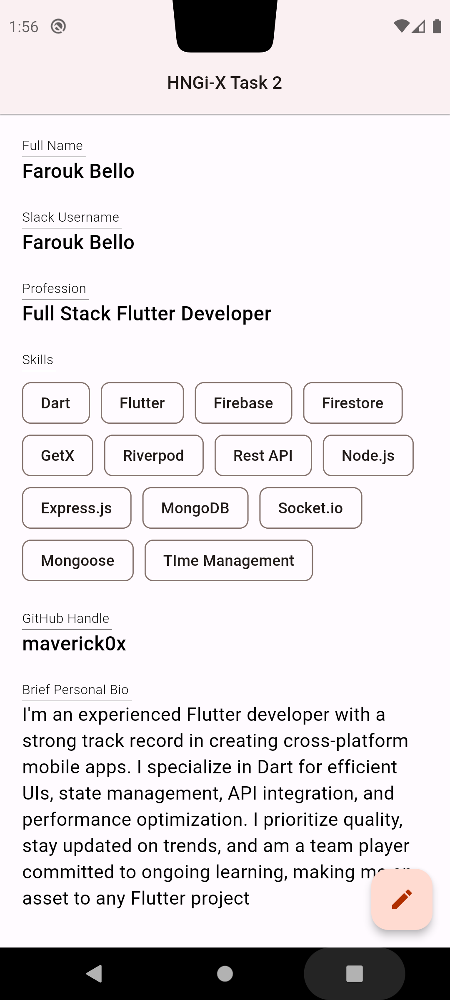
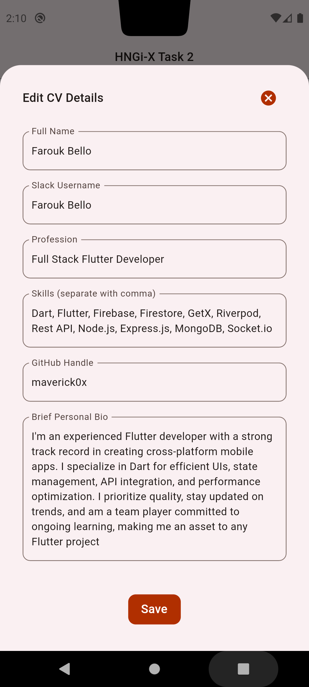

# HNGi-X Task 2

## Task: Mobile CV Application
- Develop and design a mobile application serving as a comprehensive CV, showcasing personal and professional details. The app should enable both viewing and editing of the provided CV information.

## Preview
 

## Testing the App
1. Go to this [Appetize Link](https://appetize.io/app/r4sfdtjclu2lzrotuyszeh36y4?device=pixel6&osVersion=12.0&scale=100) to access the app.
2. Select any device that supports _Android 12_ e.g **Pixel 6**.
3. Set the zoom level to 100 for better viewing.
4. Select Android 12 or above.
5. Click on **Tap to Play**.

### Interacting within the App
- Click on the button on the bottom right corner to edit CV details.
- Click on any text field you want to edit.
- Tap outside the textfield or hit enter on your keyboard to stop editing.
- Click on save to save changes and view changes on the CV page.

N.B.: If all the fields does not meet the requirement, the changes won't be saved.